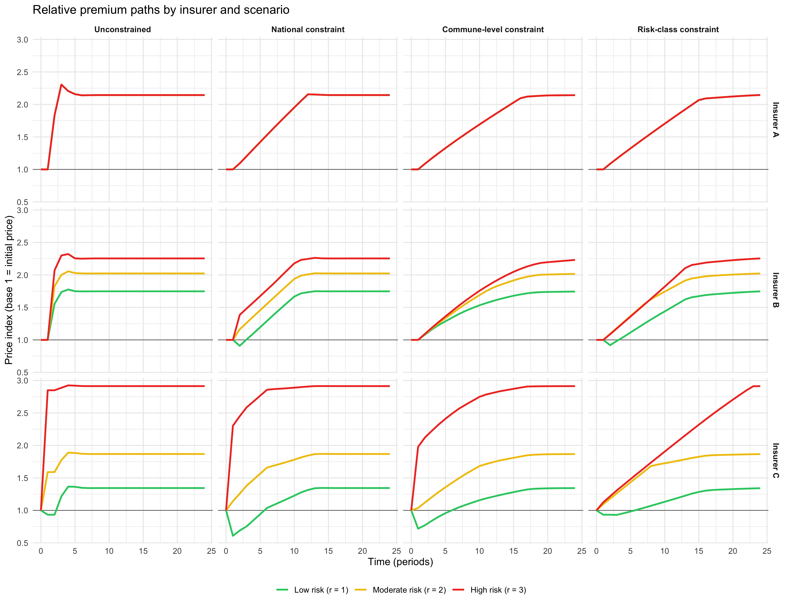
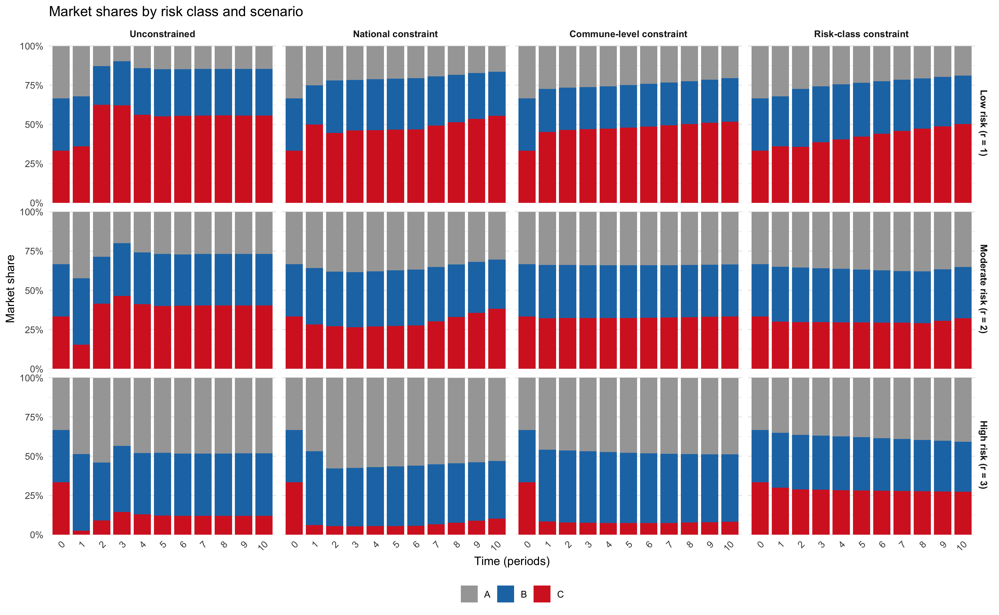
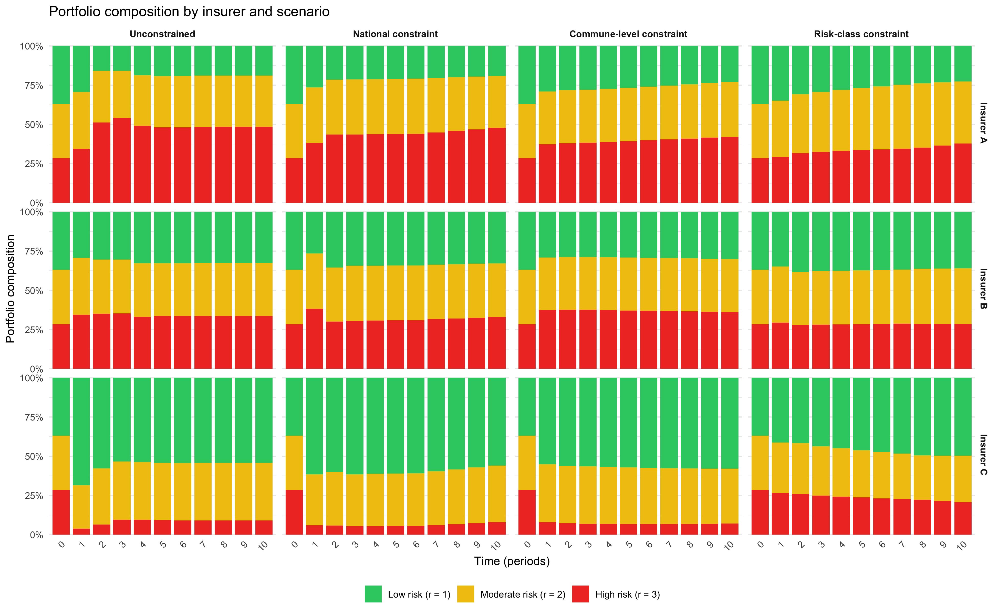
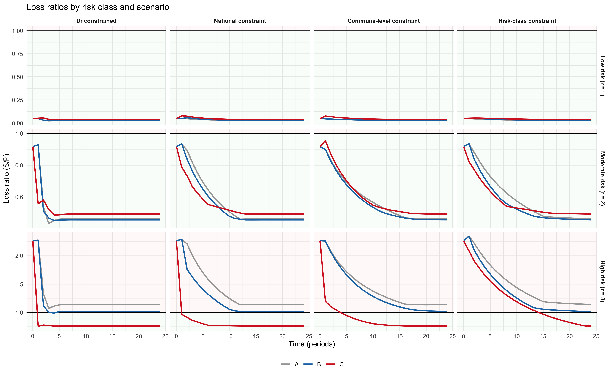

Climate Granularity, Part 1
================

- [Purpose](#purpose)
- [Exploratory quote evidence](#exploratory-quote-evidence)
- [Model core](#model-core)
- [Generate the four central
  scenarios](#generate-the-four-central-scenarios)
- [Figure helpers](#figure-helpers)
- [Figure 1: relative premiums](#figure-1-relative-premiums)
- [Figure 2: market shares by risk
  class](#figure-2-market-shares-by-risk-class)
- [Figure 3: portfolio composition](#figure-3-portfolio-composition)
- [Figure 4: loss ratios](#figure-4-loss-ratios)

# Purpose


This notebook is intentionally minimal. It provides additional detail on the controlled quote-collection exercise summarised in Section 3 of the paper, *Exploratory quote evidence*. It also rebuilds the four central scenarios and produces only the four figures used in the paper:

1.  relative premium paths by insurer and scenario;
2.  market shares by risk class and scenario;
3.  portfolio composition by insurer and scenario;
4.  loss ratios by risk class and scenario.

The notebook is self-contained.

# Exploratory quote evidence

## Pilot Study: Two-Address Contrast (Thorigny-sur-Marne)
As a preliminary proof-of-concept, we collected quotes for two addresses within the same municipality (Thorigny-sur-Marne, Seine-et-Marne) featuring sharply contrasting mapped RGA exposure levels. This pilot exercise confirms the coexistence of within-commune premium segmentation (Insurer C) and extensive-margin withdrawal (Insurer D) before deploying the full clustered protocol reported in Table 1 of the paper.

| Insurer | Very low RGA exposure (Premium in €) | Very high RGA exposure (Premium in €) |
| :--- | :---: | :---: |
| **A** | 294 | 294 |
| **B** | 572 | 572 |
| **C** | 569 | 680 |
| **D** | 208 | *No quote* |

Insurers A and B charge identical premiums at both addresses. Insurer C increases the premium by approximately 20% as the address moves from very low to very high RGA exposure within the same commune. Insurer D provides a quote at the low-exposure address but returns no purchasable offer at the high-exposure address. This two-address example is visually suggestive but less informative than the clustered contrasts in Table 1, which average over five addresses per exposure class to reduce sensitivity to idiosyncratic geocoding or cadastral artefacts. It is reported here for completeness.

## Empirical Pricing Granularity

<a id="app-a-1"></a>

### RGA (clay shrink–swell, subsidience)

**Beaumont.** Beaumont covers 4.0 km² and had 10,787 inhabitants in 2022. Located at the foothills of the volcanic uplands of the *Plateau des Dômes* and near the Limagne plain, Beaumont is structured by the Artière valley and its alluvial deposits, at the interface with sedimentary formations (marls, clays, and limestones). In this setting, the presence of clay-rich and marl layers (often described as *argilo-calcareous* units) is consistent with sensitivity to clay shrink–swell (RGA), which is triggered by alternating drought and rehydration episodes. The *Fonds Prévention Argile* classifies Beaumont as *high* RGA exposure and reports multiple Cat-Nat recognitions for drought-related ground movements, making it a natural case to illustrate within-municipality heterogeneity and its potential implications for pricing and underwriting ([Ville de Beaumont: Les mémoires de l’eau — Beaumont](https://www.beaumont63.fr/IMG/pdf/beaumont2009-eau.pdf); [Fonds Prévention Argile: Risques Retrait-Gonflement à Beaumont](https://fonds-prevention-argile.beta.gouv.fr/rga/commune/beaumont-63032)).

We selected 10 real addresses in Beaumont: 5 in low or no RGA exposure zones and 5 in medium or high RGA exposure zones, as defined by the BRGM/GeoRisques public geological susceptibility layers. Addresses were chosen to avoid obvious parcel-boundary ambiguities in the hazard mapping.

<p align="center">
  
</p>

<p align="center"><em>Figure 1. Beaumont.</em></p>

<a id="app-a-2"></a>

### Flood risk (river overflow)

**Guipry-Messac.** Guipry-Messac covers 92.0 km² and had 7,243 inhabitants in 2022. It is a valley municipality located along the Vilaine River, connected to the broader Vilaine network and local tributaries such as the Semnon in the surrounding area. The territory is covered by the *Plan de Prévention du Risque Inondation* (PPRI) “Moyenne Vilaine et affluents” (approved in 2005), which documents flood-prone areas and provides the regulatory basis for land-use constraints in exposed zones. At the basin scale, territorial diagnostics highlight the recurrence of major flood episodes (e.g., 1995, 1999, 2001, and the winter 2013–2014 sequence) and emphasize the role of downstream and upstream hydraulic infrastructure (including the Arzal dam near the estuary and several dams on the upper Vilaine) in shaping water levels and flood propagation ([Ville de Guipry-Messac: PPRI (Plan de Prévention du Risque Inondation)](https://www.guipry-messac.fr/vie-municipale/urbanisme/ppri/); [Préfecture d’Ille-et-Vilaine: diagnostic territorial — cartographie, secteur Guipry-Messac](https://www.ille-et-vilaine.gouv.fr/contenu/telechargement/64878/500662/file/Annexe_2_Diagnostic_territorial_Carto_maj2024.pdf); [Préfecture d’Ille-et-Vilaine: annexe 1 — diagnostic territorial, bassin de la Vilaine](https://www.ille-et-vilaine.gouv.fr/contenu/telechargement/65211/502712/file/Annexe_1_Diagnostic_territorial.pdf); [Sandre/Eaufrance: La Vilaine \[J---0060\]](https://www.sandre.eaufrance.fr/geo/CoursEau_Carthage2017/J---0060); [Sandre/Eaufrance: Le Semnon \[J76-0300\]](https://www.sandre.eaufrance.fr/geo/CoursEau_Carthage2017/J76-0300)).

We selected 10 real addresses in Guipry-Messac: 5 outside and 5 inside the mapped flood zone, as defined by publicly available hazard information (PPRi/TRI-type layers and GeoRisques). Selected addresses are broadly comparable on RGA exposure, so that the flood contrast is not mechanically confounded by clay susceptibility.

<p align="center">
  
</p>

<p align="center"><em>Figure 2. Guipry-Messac.</em></p>

<a id="app-empirical-details"></a>

<a id="app-protocol-cleaning"></a>
## Empirical design and protocol 

### Design Logic

The quote-collection exercise follows the logic of a controlled plan d'expérience. We hold fixed (i) the insured profile, (ii) dwelling characteristics, and (iii) the coverage, deductible, and option choices within each insurer's online quotation journey. The only factor varied by construction is the address. The objective is to attribute any change in quoted price or quote availability to geographic risk segmentation rather than to observable policyholder heterogeneity. This approach is close in spirit to audit and mystery-shopping designs used to detect differential treatment when observables are controlled by the researcher.

### Standardized insured profile 

The standardised profile serves two simultaneous objectives: it must be (i) representative enough to fall within standard rating engine parameters rather than triggering exceptional underwriting treatment, and (ii) exposed enough to climate-related property risk that fine-grained geographic variation is plausibly priced. These two constraints jointly shape every feature choice described below.

**Selection logic: representativeness through INSEE filtering**

A subset of profile features — those marked in the collection spreadsheet — were selected empirically rather than arbitrarily. The starting point is the observation that older detached houses are structurally more vulnerable to clay shrink–swell (RGA): foundations predating modern building norms are less designed to accommodate differential ground movement induced by alternating drought and rehydration cycles. We therefore wanted a profile that is both exposed along this dimension and common enough in the French housing stock to be priced routinely by insurers.
To operationalise this, we filtered the relevant INSEE housing microdata on two criteria:

- **Housing type**: detached house (maison individuelle), to select the vulnerability class relevant to ground-level and foundation-level perils (RGA and riverine flooding);
- **Construction year**: before 1990, to capture the pre-norm stock that is most exposed to RGA-related structural damage.

Conditional on these two filters, we derived the modal or most representative values for the remaining socio-demographic and dwelling characteristics. The features selected through this INSEE-based procedure are the following:

| Feature | Retained Value | Source |
| :--- | :---: | :---: |
| **Distance to nearest neighbouring dwelling** | Less than 50 m | INSEE |
| **Occupancy status** | Owner-occupier | INSEE |
| **Principal residence** | Yes | INSEE |
| **Days absent per year** | Fewer than 45 days | INSEE |
| **Habitable surface** | 120 m² | INSEE |
| **Number of rooms** | 5 rooms | INSEE |
| **Marital status** | Married | INSEE |
| **Number of residents aged 25 or over** | 2 | INSEE |
| **Number of residents aged under 25** | 0 | INSEE |
| **Occupational category** | Retired | INSEE |
| **Date of birth** | 1954  | INSEE |

This combination — a retired married couple, owner-occupiers of a 120 m² detached house built before 1980, with no young dependants — defines the modal profile within the filtered INSEE stock. It is the most internally consistent and statistically frequent profile among French households living in older detached houses, and therefore the one most likely to be priced routinely rather than flagged for manual underwriting review.

The remaining features were set to values chosen to define a straightforward, unexceptional applicant, without drawing on external data. The objective was to avoid any characteristic that might trigger non-standard treatment unrelated to geographic risk:

Across all quote requests — whether for RGA in Beaumont or for flooding in Guipry-Messac — this profile is held strictly fixed. The address is the only input that varies. Any systematic within-insurer difference in quoted premiums or quote availability across addresses can therefore be attributed to geographic risk segmentation rather than to observable policyholder or dwelling heterogeneity.

### Risk classification and address selection

We study two climate-related perils central to the French Cat-Nat debate: clay shrink–swell (RGA) and flood risk.

**RGA (clay shrink–swell).** RGA exposure is defined using public geological susceptibility layers (BRGM/GeoRisques), which classify parcels into discrete exposure categories (e.g., none/low/medium/high). We combine these layers with the local history of Cat-Nat recognitions to identify communes where RGA is both salient and spatially heterogeneous ([Géorisques: dossier expert sur le retrait-gonflement des argiles](https://www.georisques.gouv.fr/consulter-les-dossiers-thematiques/retrait-gonflement-des-argiles)). The main RGA study uses two communes in the Puy-de-Dôme (see [RGA appendix](#app-a-1)): Beaumont, a “hotspot” commune with a strong Cat-Nat drought history and meaningful within-commune heterogeneity in mapped RGA exposure. We select a total of 10 real addresses: 5 in low/no exposure and 5 in medium/high exposure  in Beaumont.

**Flood risk (river overflow).** Flood exposure is defined using publicly available hazard information (TRI/PPRI-type layers) and a binary classification of whether an address is located inside a mapped flood zone for river overflow ([Géorisques: dossier expert sur les inondations](https://www.georisques.gouv.fr/consulter-les-dossiers-thematiques/dossier-expert-sur-les-inondations)). The main flood study uses a commune in Ille-et-Vilaine (see [flood-risk appendix](#app-a-2)): Guipry-Messac, a commune crossed by the Vilaine river, with high flood recurrence and strong within-commune topographic heterogeneity. As for RGA, we collect 10 addresses in Guipry-Messac : 5 outside and 5 inside the flood zone. We additionally ensure that selected addresses are broadly comparable on RGA exposure so that the flood contrast is not mechanically confounded by clay susceptibility.

Grouping addresses in “clusters of five” allows us to average premiums within risk classes and reduce the influence of idiosyncratic geocoding issues.

### Identification logic and empirical summaries

Our identification strategy relies on tightly controlled within-area comparisons. Within a narrow geographic scope (same commune), and holding the insured profile and contract choices fixed, any systematic *within-insurer* premium differences across addresses that align with mapped hazard exposure indicate the use of fine-grained geographic risk classification.

Our interpretation rests on two simple points. First, by construction, the only input that changes across observations is location; all policyholder and dwelling characteristics are fixed. Second, the perils we study (RGA and riverine flooding) feature sharp micro-spatial gradients that can plausibly vary within a single commune, making address-level overlays and geocoded scoring operationally relevant ([Moriah et al.: *Contributions of geolocated weather and building-related data for insurance assessment of flood risks*](https://arxiv.org/abs/2603.02418)). In this context, systematic within-insurer premium differences between low- and high-exposure addresses inside the same commune are consistent with fine-grained geographic risk classification, while systematic reductions in quote rates in the highest-exposure micro-areas capture extensive-margin supply restriction (selective non-quoting/withdrawal).

Given the small sample sizes inherent to a controlled quote design, we summarize outcomes using cluster-level averages (five addresses per exposure class) and insurer-specific contrasts. 


### Quote collection protocol and cleaning

This appendix documents the data-generating process behind our empirical evidence on pricing granularity and insurer withdrawal in French household insurance (MRH, hereafter “household insurance”).

**Design logic: a controlled “plan d’expérience”.** Because we observe *quotes* rather than portfolio or claims data, we treat the data collection as a controlled experiment in the sense of general insurance pricing practice ([Parodi: *Pricing in General Insurance*](https://www.taylorfrancis.com/books/mono/10.1201/9781003168881/pricing-general-insurance-pietro-parodi)). We hold fixed (i) the insured profile, (ii) dwelling characteristics, and (iii) the coverage/franchise/option choices within each insurer’s quotation journey; the only factor that varies by construction is *location*. The purpose is to attribute any change in price or offer availability to geographic segmentation rather than to observable policyholder heterogeneity.

**Standardized insured profile.** We construct a single, representative profile using INSEE housing/household statistics (as in the thesis). The retained profile is a retired couple insuring their principal residence, a detached house built before 1990. This choice is deliberate: (i) it is common enough not to be an outlier in insurers’ rating engines, and (ii) it is plausibly exposed to both clay shrink–swell (RGA) and riverine flooding (houses/ground-floor dwellings are the relevant vulnerability class). In all quote requests, this profile is kept identical; the address is the only element that changes.

**Insurer panel and anonymization.** We rely on a panel of four household insurers (anonymized as A–D). The panel is not intended to be exhaustive; the empirical results should be read as *illustrative evidence* of mechanisms (pricing segmentation vs. non-availability) rather than as market-wide parameter estimates ([Mildenhall and Major: *Pricing Insurance Risk: Theory and Practice*](https://onlinelibrary.wiley.com/doi/book/10.1002/9781119756538)).

**Choice of case-study communes and addresses.** For each peril, we implement the same layer comparison: *within-commune* (high- vs. low-exposure addresses inside a “hotspot” commune, to detect infra-communal granularity).

- **RGA (clay shrink–swell).** We select a commune in the Puy-de-Dôme (63):  *Beaumont* (63110) as a hotspot with heterogeneous BRGM exposure within the commune and a strong CatNat history. We then select 10 real addresses in Beaumont split into two clusters of 5 in (i) high-exposure zones and (ii) low/no-exposure zones :

- **Riverine flooding (overflow).** We select one commune in Ille-et-Vilaine (35): *Guipry-Messac* (35480) as a hotspot commune along the Vilaine with clear topographic heterogeneity. We keep the same sample size : 10 real addresses in Guipry-Messac, split into 5 inside mapped flood-prone areas and 5 outside;

**Quote requests and recorded outcomes.** For each address and each insurer, we submit a quote request for the standardized profile. The recorded outcome is:

1. an annual premium quote (when an offer is made), together with the associated product/coverage information returned by the quotation journey; or
2. a *non-quote* (no offer made), interpreted as local non-availability/withdrawal at the quotation stage.

**Cleaning and construction of analysis objects.** We apply the following cleaning and aggregation steps:

- **Within-insurer comparisons only.** Household insurance products are not standardized across insurers (coverage limits, deductibles, and package structures differ). Therefore, we do not compare premium *levels* across insurers; we only analyze within-insurer variation across locations, consistent with pricing comparability concerns ([Mildenhall and Major: *Pricing Insurance Risk: Theory and Practice*](https://onlinelibrary.wiley.com/doi/book/10.1002/9781119756538)).
- **Exposure coding and boundary avoidance.** Each address is assigned to an exposure class using the relevant hazard maps (RGA: BRGM exposure classes; flooding: official flood mapping used in the thesis). To reduce sensitivity to insurer geocoding or parcel-level idiosyncrasies, addresses were chosen to avoid obvious boundary ambiguities when possible.
- **Spatial repetition and cluster averaging.** To mitigate the risk that a single address drives results because of a geocoding error or an unobserved cadastral specificity, we aggregate outcomes at the cluster level: we compute (i) offer rates (number of offers out of 5) and (ii) average premiums across the 5 addresses in each exposure cluster. This is the primary “robustness by design” device in the thesis ([Parodi: *Pricing in General Insurance*](https://www.taylorfrancis.com/books/mono/10.1201/9781003168881/pricing-general-insurance-pietro-parodi)).
- **Treatment of non-quotes.** We keep a separate availability indicator for each insurer–cluster pair. Premium statistics are computed conditional on offers being made; non-quotes enter the analysis through the availability margin.

<a id="app-robustness"></a>

### Additional robustness checks and alternative specifications

Given the small sample size by construction, robustness is assessed through re-aggregation choices and alternative codings rather than asymptotic inference. In addition to the spatial repetition described above, the following checks are natural and will be reported in extended tables/figures as the paper evolves:

**Alternative aggregators.** We recompute cluster-level outcomes using the *median* premium (instead of the mean) to reduce sensitivity to occasional quotation outliers. We also report the full within-cluster premium range to document operational dispersion.

**Leave-one-out (jackknife) across addresses.** For each cluster of five addresses, we recompute the cluster premium after removing one address at a time. This produces a simple influence diagnostic: if a pricing-granularity result disappears when a single address is removed, it is more likely to reflect an idiosyncratic coding/geocoding artifact than a structural rating rule.

**Alternative exposure definitions.** We test the stability of results to how “high” vs. “low” exposure is defined:

- **RGA:** grouping BRGM classes as (medium+high) vs. (none+low), versus a stricter split (high only) vs. (none+low).
- **Flooding:** (inside vs. outside) mapped flood-prone areas, versus distance-based bins to the main river segment (when distance can be constructed consistently from GIS layers).

**Availability margin: alternative coding.** We verify that conclusions about withdrawal are not driven by a single interpretation of “non-quote” by (i) treating non-quotes as missing (availability analysis only), and (ii) re-expressing availability as a binary outcome in simple descriptive regressions (logit/probit) with cluster-level exposure indicators.

**Premium transformation.** Where premiums are available, we replicate the main graphs using log-premiums and within-insurer normalized premiums (premium divided by the insurer's mean premium across all offered quotes in the peril-specific sample) to ensure that findings are not an artifact of scale.

# Model core

``` r
run_market_simulation <- function(
  scenario = c("unconstrained", "national", "commune", "risk_class"),
  seed = 123,
  I = 20,
  N_POP = 500,
  DIRICHLET_ALPHA = rep(1, 3),
  RISK_PROB = c(0.1, 0.6, 0.9),
  RISK_COST_PROB = c(0.2, 0.5, 0.8),
  ALPHA = 10.0,
  BETA_PRICE = 1.0,
  V_INSURER = c(A = 0.0, B = 0.0, C = 0.0),
  ETA_CAT = 1.0,
  MS_CONSTRAINT = 0.10,
  DAMPING_NU = 1.0,
  DENOM_EPSILON = 0.01,
  PRICE_LB = 0.01,
  PRICE_UB = ALPHA,
  CHARGE_FACTOR = 1.02,
  T_MAX = 39,
  T_INSPECT = 35,
  quiet = TRUE
) {
  scenario <- match.arg(scenario)

  if (scenario == "unconstrained") {
    # Same optimizer and local constraint block as the base script, but with a zero floor.
    constraint_type <- "commune"
    MS_CONSTRAINT <- 1.0
  } else if (scenario == "national") {
    constraint_type <- "national"
  } else if (scenario == "commune") {
    constraint_type <- "commune"
  } else if (scenario == "risk_class") {
    constraint_type <- "risk_class"
  }

  ASSURERS_CONFIG <- list(
    A = list(archetype = "national", activation_active = TRUE, t_start = 2,
             t_change = NULL, new_archetype = NULL, ms_constraint = MS_CONSTRAINT),
    B = list(archetype = "communal", activation_active = TRUE, t_start = 2,
             t_change = NULL, new_archetype = NULL, ms_constraint = MS_CONSTRAINT),
    C = list(archetype = "communal_risk", activation_active = TRUE, t_start = 1,
             t_change = NULL, new_archetype = NULL, ms_constraint = MS_CONSTRAINT)
  )

  get_v_insurer <- function(name) {
    if (!is.null(names(V_INSURER)) && name %in% names(V_INSURER)) return(V_INSURER[[name]])
    0.0
  }

  rdirichlet <- function(n, alpha) {
    k <- length(alpha)
    x <- matrix(
      rgamma(n * k, shape = rep(alpha, each = n), rate = 1),
      nrow = n,
      ncol = k,
      byrow = FALSE
    )
    x / rowSums(x)
  }

  set.seed(seed)
  N <- rep(N_POP, I)
  risk_props <- rdirichlet(I, DIRICHLET_ALPHA)

  risk_prob <- RISK_PROB
  risk_cost_prob <- RISK_COST_PROB
  alpha <- ALPHA

  risk_cost <- ETA_CAT * alpha * risk_cost_prob
  comm_cost <- as.vector(risk_props %*% (risk_cost * risk_prob))
  u <- as.vector(risk_props %*% risk_prob)

  get_archetype_shape <- function(archetype_key, I_communes = I) {
    if (archetype_key == "national") return(1)
    if (archetype_key == "communal") return(I_communes)
    if (archetype_key == "communal_risk") return(c(I_communes, 3))
    stop(sprintf("Unknown archetype: %s", archetype_key))
  }

  reshape_price_to_standard <- function(price, archetype_key, I_communes = I) {
    if (archetype_key == "national") {
      return(matrix(as.numeric(price)[1], nrow = I_communes, ncol = 3))
    }
    if (archetype_key == "communal") {
      price_vec <- as.numeric(price)
      if (length(price_vec) != I_communes) stop("Invalid communal price vector length.")
      return(matrix(rep(price_vec, each = 3), nrow = I_communes, ncol = 3, byrow = TRUE))
    }
    if (archetype_key == "communal_risk") {
      if (is.matrix(price) && all(dim(price) == c(I_communes, 3))) return(price)
      price_vec <- as.numeric(price)
      if (length(price_vec) != I_communes * 3) stop("Invalid communal-risk price vector length.")
      return(matrix(price_vec, nrow = I_communes, ncol = 3, byrow = TRUE))
    }
    stop(sprintf("Unknown archetype: %s", archetype_key))
  }

  reshape_price_from_standard <- function(price_matrix, archetype_key, I_communes = I) {
    price_matrix <- matrix(as.numeric(price_matrix), nrow = I_communes, ncol = 3)
    if (archetype_key == "national") return(mean(price_matrix))
    if (archetype_key == "communal") return(rowMeans(price_matrix))
    if (archetype_key == "communal_risk") return(as.vector(t(price_matrix)))
    stop(sprintf("Unknown archetype: %s", archetype_key))
  }

  archetype_vector_to_object <- function(price_flat, archetype_key, I_communes = I) {
    if (archetype_key == "national") return(as.numeric(price_flat)[1])
    if (archetype_key == "communal") return(as.numeric(price_flat))
    if (archetype_key == "communal_risk") {
      return(matrix(as.numeric(price_flat), nrow = I_communes, ncol = 3, byrow = TRUE))
    }
    stop(sprintf("Unknown archetype: %s", archetype_key))
  }

  standardize_price_input <- function(price, name = "") {
    p <- as.numeric(price)
    if (length(p) == 1) return(matrix(p[1], nrow = I, ncol = 3))
    if (is.matrix(price) && all(dim(price) == c(I, 3))) return(price)
    if (length(p) == I * 3) return(matrix(p, nrow = I, ncol = 3, byrow = TRUE))
    stop(sprintf("Invalid price shape for %s", name))
  }

  shares_infr_comm <- function(prices_dict) {
    prices_std <- list()
    for (name in names(prices_dict)) {
      prices_std[[name]] <- standardize_price_input(prices_dict[[name]], name)
    }

    sorted_names <- sort(names(prices_std))
    alpha_u <- matrix(alpha * u, nrow = I, ncol = 3)

    exp_utils_list <- lapply(sorted_names, function(name) {
      utilities <- alpha_u + get_v_insurer(name) - BETA_PRICE * prices_std[[name]]
      utilities <- pmin(pmax(utilities, -500.0), 400.0)
      exp(utilities)
    })

    denom <- Reduce("+", exp_utils_list) + DENOM_EPSILON

    result <- list()
    for (idx in seq_along(sorted_names)) {
      name <- sorted_names[[idx]]
      result[[name]] <- exp_utils_list[[idx]] / denom
    }
    result
  }

  shares_comm <- function(prices_dict) {
    shares_infr <- shares_infr_comm(prices_dict)
    lapply(shares_infr, function(mat) rowSums(mat * risk_props))
  }

  shares <- function(prices_dict) {
    shares_c <- shares_comm(prices_dict)
    lapply(shares_c, mean)
  }

  shares_by_risk_class <- function(prices_dict, insurer_name) {
    share_mat <- shares_infr_comm(prices_dict)[[insurer_name]]
    risk_weights <- sweep(risk_props, 1, N, `*`)
    vapply(seq_len(ncol(risk_weights)), function(rr) {
      sum(risk_weights[, rr] * share_mat[, rr]) / sum(risk_weights[, rr])
    }, numeric(1))
  }

  primepure <- function() {
    sum(N * (comm_cost * u)) / sum(N)
  }

  profit <- function(assurer_name, prices_std_dict) {
    shares_infr <- shares_infr_comm(prices_std_dict)
    share_assurer <- shares_infr[[assurer_name]]
    N_risk <- matrix(N, nrow = I, ncol = 3) * risk_props
    pure_ir <- outer(u, risk_cost * risk_prob)
    profit_infr <- (share_assurer * N_risk) *
      (prices_std_dict[[assurer_name]] - pure_ir)
    sum(profit_infr)
  }

  profit_neg <- function(assurer_name, prices_std_dict) {
    -profit(assurer_name, prices_std_dict)
  }

  init_prices_for_assurer <- function(assurer_name) {
    archetype <- ASSURERS_CONFIG[[assurer_name]]$archetype
    pp_base <- primepure() * CHARGE_FACTOR
    if (archetype == "national") return(pp_base)
    if (archetype == "communal") return(rep(pp_base, I))
    if (archetype == "communal_risk") return(matrix(pp_base, nrow = I, ncol = 3))
    stop(sprintf("Unknown archetype: %s", archetype))
  }

  get_bounds_for_assurer <- function(assurer_name, archetype_key = NULL) {
    if (is.null(archetype_key)) archetype_key <- ASSURERS_CONFIG[[assurer_name]]$archetype
    n_params <- prod(get_archetype_shape(archetype_key))
    list(lower = rep(PRICE_LB, n_params), upper = rep(PRICE_UB, n_params))
  }

  prices_opts <- list()
  for (name in names(ASSURERS_CONFIG)) {
    prices_opts[[name]] <- list(init_prices_for_assurer(name))
  }

  archetype_history <- lapply(ASSURERS_CONFIG, function(cfg) cfg$archetype)
  prices_std_history <- list()
  for (name in names(ASSURERS_CONFIG)) {
    cfg <- ASSURERS_CONFIG[[name]]
    prices_std_history[[name]] <- list(
      reshape_price_to_standard(prices_opts[[name]][[1]], cfg$archetype)
    )
  }

  for (t in seq_len(T_MAX)) {
    current_archetype <- list()
    for (name in names(ASSURERS_CONFIG)) {
      cfg <- ASSURERS_CONFIG[[name]]
      if (!is.null(cfg$t_change) && t >= cfg$t_change) {
        current_archetype[[name]] <- cfg$new_archetype
        archetype_history[[name]] <- c(archetype_history[[name]], cfg$new_archetype)
      } else {
        current_archetype[[name]] <- cfg$archetype
        archetype_history[[name]] <- c(archetype_history[[name]], cfg$archetype)
      }
    }

    prices_std_prev <- list()
    for (name in names(ASSURERS_CONFIG)) {
      prices_std_prev[[name]] <- prices_std_history[[name]][[t]]
    }
    prices_std_new <- lapply(prices_std_prev, function(x) x)

    for (name in sort(names(ASSURERS_CONFIG))) {
      cfg <- ASSURERS_CONFIG[[name]]
      if (!cfg$activation_active || t < cfg$t_start) next

      prices_others_std <- prices_std_prev[names(prices_std_prev) != name]

      profit_partial <- function(price_flat) {
        prices_test <- prices_others_std
        price_obj <- archetype_vector_to_object(price_flat, current_archetype[[name]])
        prices_test[[name]] <- reshape_price_to_standard(price_obj, current_archetype[[name]])
        profit_neg(name, prices_test)
      }

      if (constraint_type == "national") {
        share_prev <- shares(prices_std_prev)[[name]]
        share_floor <- share_prev * (1 - cfg$ms_constraint)
        constraint_market_share <- function(price_flat) {
          prices_test <- prices_others_std
          price_obj <- archetype_vector_to_object(price_flat, current_archetype[[name]])
          prices_test[[name]] <- reshape_price_to_standard(price_obj, current_archetype[[name]])
          share_test <- shares(prices_test)[[name]]
          share_test - share_floor
        }
      } else if (constraint_type == "risk_class") {
        share_prev <- shares_by_risk_class(prices_std_prev, name)
        share_floor <- share_prev * (1 - cfg$ms_constraint)
        constraint_market_share <- function(price_flat) {
          prices_test <- prices_others_std
          price_obj <- archetype_vector_to_object(price_flat, current_archetype[[name]])
          prices_test[[name]] <- reshape_price_to_standard(price_obj, current_archetype[[name]])
          share_test <- shares_by_risk_class(prices_test, name)
          share_test - share_floor
        }
      } else {
        share_prev <- shares_comm(prices_std_prev)[[name]]
        share_floor <- share_prev * (1 - cfg$ms_constraint)
        constraint_market_share <- function(price_flat) {
          prices_test <- prices_others_std
          price_obj <- archetype_vector_to_object(price_flat, current_archetype[[name]])
          prices_test[[name]] <- reshape_price_to_standard(price_obj, current_archetype[[name]])
          share_test <- shares_comm(prices_test)[[name]]
          share_test - share_floor
        }
      }

      bounds <- get_bounds_for_assurer(name, current_archetype[[name]])
      price_init <- as.numeric(reshape_price_from_standard(prices_std_prev[[name]], current_archetype[[name]]))

      slsqp_args <- list(
        x0 = price_init,
        fn = profit_partial,
        lower = bounds$lower,
        upper = bounds$upper,
        hin = constraint_market_share,
        nl.info = FALSE,
        control = list(maxeval = 1000, xtol_rel = 1e-6)
      )
      if ("deprecatedBehavior" %in% names(formals(nloptr::slsqp))) {
        slsqp_args$deprecatedBehavior <- TRUE
      }

      res <- tryCatch(
        do.call(nloptr::slsqp, slsqp_args),
        error = function(e) {
          warning(sprintf("Optimization failed for insurer %s at t=%s: %s", name, t, e$message))
          NULL
        }
      )

      if (!is.null(res) && !is.null(res$par) && isTRUE(res$convergence >= 0)) {
        price_obj <- archetype_vector_to_object(res$par, current_archetype[[name]])
        prices_std_new[[name]] <- reshape_price_to_standard(price_obj, current_archetype[[name]])
      }
    }

    if (exists("DAMPING_NU")) {
      for (nm in names(prices_std_new)) {
        prices_std_new[[nm]] <- (1 - DAMPING_NU) * prices_std_prev[[nm]] + DAMPING_NU * prices_std_new[[nm]]
      }
    }

    for (name in names(ASSURERS_CONFIG)) {
      prices_std_history[[name]][[length(prices_std_history[[name]]) + 1]] <- prices_std_new[[name]]
      price_archetype_form <- reshape_price_from_standard(prices_std_new[[name]], current_archetype[[name]])
      prices_opts[[name]][[length(prices_opts[[name]]) + 1]] <- price_archetype_form
    }
  }

  records <- list()
  for (t in 0:T_MAX) {
    prices_for_shares <- list()
    for (name in sort(names(ASSURERS_CONFIG))) {
      prices_for_shares[[name]] <- prices_std_history[[name]][[t + 1]]
    }
    shares_dict <- shares_infr_comm(prices_for_shares)

    pure_ir <- outer(u, risk_cost * risk_prob)
    lr_comm <- list()
    lr_global <- list()
    for (assurer_name in sort(names(ASSURERS_CONFIG))) {
      share_ir <- shares_dict[[assurer_name]]
      prix_ir <- prices_for_shares[[assurer_name]]
      weight_ir <- share_ir * matrix(N, nrow = I, ncol = 3) * risk_props
      claims_comm <- rowSums(weight_ir * pure_ir)
      premiums_comm <- rowSums(weight_ir * prix_ir)
      lr_comm[[assurer_name]] <- ifelse(premiums_comm > 0, claims_comm / premiums_comm, NA_real_)
      claims_global <- sum(weight_ir * pure_ir)
      premiums_global <- sum(weight_ir * prix_ir)
      lr_global[[assurer_name]] <- ifelse(premiums_global > 0, claims_global / premiums_global, NA_real_)
    }

    alpha_u <- matrix(alpha * u, nrow = I, ncol = 3)
    utilities <- list()
    for (assurer_name in sort(names(ASSURERS_CONFIG))) {
      utilities[[assurer_name]] <- alpha_u + get_v_insurer(assurer_name) - BETA_PRICE * prices_for_shares[[assurer_name]]
    }
    exp_util_sum <- Reduce("+", lapply(utilities, function(mat) exp(pmin(pmax(mat, -500.0), 400.0))))
    logsum_ir <- (1 / BETA_PRICE) * log(exp_util_sum)

    N_mat <- matrix(N, nrow = I, ncol = 3)
    welfare_ea_comm <- rowSums(logsum_ir * risk_props) * N
    welfare_ea_risk <- colSums(logsum_ir * risk_props * N_mat)
    welfare_ea_global <- sum(welfare_ea_comm)
    welfare_ea_ir <- logsum_ir * risk_props * N_mat

    avg_util_ir <- matrix(0, nrow = I, ncol = 3)
    for (assurer_name in sort(names(ASSURERS_CONFIG))) {
      share_ir <- shares_dict[[assurer_name]]
      prix_ir <- prices_for_shares[[assurer_name]]
      avg_util_ir <- avg_util_ir + share_ir * (pure_ir - prix_ir)
    }
    welfare_ep_ir <- N_mat * risk_props * avg_util_ir
    welfare_ep_comm <- rowSums(welfare_ep_ir)
    welfare_ep_risk <- colSums(welfare_ep_ir)
    welfare_ep_global <- sum(welfare_ep_ir)

    for (i in seq_len(I)) {
      for (r in 1:3) {
        row_base <- list(
          period = t,
          commune_id = i - 1,
          risk_class = r - 1,
          commune_name = sprintf("commune_%s", i - 1),
          N_commune = N[i],
          risk_proportion = risk_props[i, r],
          risk_cost = risk_cost[r],
          risk_prob = u[i]
        )

        for (assurer_name in sort(names(ASSURERS_CONFIG))) {
          prix <- prices_for_shares[[assurer_name]][i, r]
          prixpure <- risk_cost[r] * risk_prob[r] * u[i]
          row_base[[sprintf("%s_prix", assurer_name)]] <- prix
          row_base[[sprintf("%s_prixpure", assurer_name)]] <- prixpure
          row_base[[sprintf("%s_marge_infr", assurer_name)]] <- prix - prixpure
        }

        for (assurer_name in sort(names(ASSURERS_CONFIG))) {
          share_val <- shares_dict[[assurer_name]][i, r]
          prix <- prices_for_shares[[assurer_name]][i, r]
          prixpure <- risk_cost[r] * risk_prob[r] * u[i]
          row_base[[sprintf("%s_part", assurer_name)]] <- share_val
          row_base[[sprintf("%s_profit_contrib", assurer_name)]] <-
            share_val * N[i] * risk_props[i, r] * (prix - prixpure)
          row_base[[sprintf("%s_LR_ir", assurer_name)]] <- ifelse(prix > 0, prixpure / prix, NA_real_)
          row_base[[sprintf("%s_LR_comm", assurer_name)]] <- lr_comm[[assurer_name]][i]
          row_base[[sprintf("%s_LR_global", assurer_name)]] <- lr_global[[assurer_name]]
        }

        row_base$welfare_ea_ir <- welfare_ea_ir[i, r]
        row_base$welfare_ea_comm <- welfare_ea_comm[i]
        row_base$welfare_ea_risk <- welfare_ea_risk[r]
        row_base$welfare_ea_global <- welfare_ea_global
        row_base$welfare_ep_ir <- welfare_ep_ir[i, r]
        row_base$welfare_ep_comm <- welfare_ep_comm[i]
        row_base$welfare_ep_risk <- welfare_ep_risk[r]
        row_base$welfare_ep_global <- welfare_ep_global

        records[[length(records) + 1]] <- row_base
      }
    }
  }

  out <- do.call(rbind.data.frame, lapply(records, as.data.frame))
  out$scenario_key <- scenario
  out
}
```

# Generate the four central scenarios

``` r
scenario_specs <- list(
  central_unconstrained = list(label = "Unconstrained", scenario = "unconstrained"),
  central_weak_global   = list(label = "National constraint", scenario = "national"),
  central_strong_local  = list(label = "Commune-level constraint", scenario = "commune"),
  central_risk_class    = list(label = "Risk-class constraint", scenario = "risk_class")
)

scenario_data <- list()
for (nm in names(scenario_specs)) {
  spec <- scenario_specs[[nm]]
  message("Running ", spec$label)
  scenario_data[[spec$label]] <- run_market_simulation(
    scenario = spec$scenario,
    seed = params$seed,
    I = params$n_communes,
    N_POP = params$n_pop,
    MS_CONSTRAINT = params$ms_constraint,
    T_MAX = params$t_max,
    T_INSPECT = params$t_inspect
  )
  if (isTRUE(params$export_csv)) {
    write.csv(
      scenario_data[[spec$label]],
      file.path(params$csv_dir, paste0(nm, ".csv")),
      row.names = FALSE
    )
  }
}
```

# Figure helpers

``` r
scenario_levels <- c(
  "Unconstrained",
  "National constraint",
  "Commune-level constraint",
  "Risk-class constraint"
)

risk_levels <- c(
  "Low risk (r = 1)",
  "Moderate risk (r = 2)",
  "High risk (r = 3)"
)

risk_label_clean <- function(x) {
  out <- dplyr::case_when(
    as.character(x) %in% c("0", "1") ~ "Low risk (r = 1)",
    as.character(x) %in% c("1", "2") & as.numeric(as.character(x)) == 1 ~ "Moderate risk (r = 2)",
    as.character(x) %in% c("2", "3") & as.numeric(as.character(x)) == 2 ~ "High risk (r = 3)",
    TRUE ~ as.character(x)
  )
  # Safer explicit mapping for the simulation output, where risk_class is 0, 1, 2.
  out[as.character(x) == "0"] <- "Low risk (r = 1)"
  out[as.character(x) == "1"] <- "Moderate risk (r = 2)"
  out[as.character(x) == "2"] <- "High risk (r = 3)"
  factor(out, levels = risk_levels)
}

insurer_palette <- c(A = "#A6A6A6", B = "#1F77B4", C = "#D62728")
risk_palette <- c(
  "Low risk (r = 1)" = "#2ECC71",
  "Moderate risk (r = 2)" = "#F1C40F",
  "High risk (r = 3)" = "#EF3B2C"
)

weighted_mean_safe <- function(x, w) {
  ok <- is.finite(x) & is.finite(w) & w > 0
  if (!any(ok)) return(NA_real_)
  sum(x[ok] * w[ok]) / sum(w[ok])
}

make_scenario_bind <- function(fun) {
  bind_rows(lapply(names(scenario_data), function(sc) {
    fun(scenario_data[[sc]], sc)
  })) %>%
    mutate(scenario = factor(scenario, levels = scenario_levels))
}

save_plot <- function(plot, filename, width, height, dpi = 300) {
  png_path <- file.path(params$fig_dir, paste0(filename, ".png"))
  ggsave(png_path, plot = plot, width = width, height = height, dpi = dpi)
  if (isTRUE(params$save_pdf)) {
    pdf_path <- file.path(params$fig_dir, paste0(filename, ".pdf"))
    ggsave(pdf_path, plot = plot, width = width, height = height)
  }
  invisible(png_path)
}
```

# Figure 1: relative premiums

``` r
make_premium_by_risk_all_insurers <- function(df, scenario, n_periods = 24) {
  df %>%
    filter(period <= n_periods) %>%
    mutate(
      risk_label = risk_label_clean(risk_class),
      weight = N_commune * risk_proportion
    ) %>%
    pivot_longer(
      cols = all_of(c("A_prix", "B_prix", "C_prix")),
      names_to = "insurer",
      names_pattern = "(.*)_prix",
      values_to = "price"
    ) %>%
    group_by(insurer, period, risk_label) %>%
    summarise(price = weighted_mean_safe(price, weight), .groups = "drop") %>%
    arrange(insurer, risk_label, period) %>%
    group_by(insurer, risk_label) %>%
    mutate(price_index = price / first(price)) %>%
    ungroup() %>%
    mutate(
      scenario = scenario,
      insurer = factor(insurer, levels = c("A", "B", "C")),
      risk_label = factor(risk_label, levels = risk_levels)
    )
}

premium_all <- make_scenario_bind(make_premium_by_risk_all_insurers)
```

``` r
p_premium <- ggplot(
  premium_all,
  aes(x = period, y = price_index, color = risk_label)
) +
  geom_hline(yintercept = 1, linewidth = 0.35, color = "grey35") +
  geom_line(linewidth = 1.0) +
  facet_grid(
    rows = vars(insurer),
    cols = vars(scenario),
    labeller = labeller(insurer = c(A = "Insurer A", B = "Insurer B", C = "Insurer C"))
  ) +
  scale_color_manual(values = risk_palette, drop = FALSE) +
  labs(
    title = "Relative premium paths by insurer and scenario",
    x = "Time (periods)",
    y = "Price index (base 1 = initial price)",
    color = NULL
  ) +
  theme_minimal(base_size = 12) +
  theme(
    legend.position = "bottom",
    strip.text = element_text(face = "bold")
  )

p_premium
```



``` r
save_plot(p_premium, "premium-facets-all-insurers", width = 13, height = 10)
```

# Figure 2: market shares by risk class

``` r
make_market_share_by_risk <- function(df, scenario, n_periods = 10) {
  df %>%
    filter(period <= n_periods) %>%
    mutate(
      risk_label = risk_label_clean(risk_class),
      weight = N_commune * risk_proportion
    ) %>%
    pivot_longer(
      cols = all_of(c("A_part", "B_part", "C_part")),
      names_to = "insurer",
      names_pattern = "(.*)_part",
      values_to = "share"
    ) %>%
    group_by(period, risk_label, insurer) %>%
    summarise(avg_share = weighted_mean_safe(share, weight), .groups = "drop") %>%
    mutate(
      scenario = scenario,
      scenario = factor(scenario, levels = scenario_levels),
      risk_label = factor(risk_label, levels = risk_levels),
      insurer = factor(insurer, levels = c("A", "B", "C"))
    )
}

ms_all <- make_scenario_bind(make_market_share_by_risk)
```

``` r
p_market <- ggplot(ms_all, aes(x = factor(period), y = avg_share, fill = insurer)) +
  geom_col(width = 0.85) +
  facet_grid(rows = vars(risk_label), cols = vars(scenario), drop = FALSE) +
  scale_y_continuous(
    labels = percent_format(accuracy = 1),
    breaks = seq(0, 1, by = 0.25),
    limits = c(0, 1),
    expand = expansion(mult = c(0, 0.02))
  ) +
  scale_fill_manual(values = insurer_palette, drop = FALSE) +
  labs(
    title = "Market shares by risk class and scenario",
    x = "Time (periods)",
    y = "Market share",
    fill = NULL
  ) +
  theme_minimal(base_size = 11) +
  theme(
    legend.position = "bottom",
    strip.text = element_text(face = "bold"),
    axis.text.x = element_text(angle = 45, hjust = 1),
    panel.grid.major.x = element_blank()
  )

p_market
```



``` r
save_plot(p_market, "market-share-facets", width = 13, height = 8)
```

# Figure 3: portfolio composition

``` r
make_portfolio_composition <- function(df, scenario, n_periods = 10) {
  df %>%
    filter(period <= n_periods) %>%
    mutate(
      risk_label = risk_label_clean(risk_class),
      segment_weight = N_commune * risk_proportion
    ) %>%
    pivot_longer(
      cols = all_of(c("A_part", "B_part", "C_part")),
      names_to = "insurer",
      names_pattern = "(.*)_part",
      values_to = "segment_market_share"
    ) %>%
    mutate(portfolio_mass = segment_weight * segment_market_share) %>%
    group_by(period, insurer, risk_label) %>%
    summarise(portfolio_mass = sum(portfolio_mass, na.rm = TRUE), .groups = "drop") %>%
    tidyr::complete(
      period,
      insurer = c("A", "B", "C"),
      risk_label = factor(risk_levels, levels = risk_levels),
      fill = list(portfolio_mass = 0)
    ) %>%
    mutate(
      scenario = scenario,
      scenario = factor(scenario, levels = scenario_levels),
      insurer = factor(insurer, levels = c("A", "B", "C")),
      risk_label = factor(risk_label, levels = risk_levels)
    )
}

portfolio_all <- make_scenario_bind(make_portfolio_composition)
```

``` r
p_portfolio <- ggplot(
  portfolio_all,
  aes(x = factor(period), y = portfolio_mass, fill = risk_label)
) +
  geom_col(width = 0.85, position = "fill") +
  facet_grid(
    rows = vars(insurer),
    cols = vars(scenario),
    labeller = labeller(insurer = c(A = "Insurer A", B = "Insurer B", C = "Insurer C")),
    drop = FALSE
  ) +
  scale_y_continuous(
    labels = percent_format(accuracy = 1),
    breaks = seq(0, 1, by = 0.25),
    expand = expansion(mult = c(0, 0.02))
  ) +
  scale_fill_manual(values = risk_palette, drop = FALSE) +
  labs(
    title = "Portfolio composition by insurer and scenario",
    x = "Time (periods)",
    y = "Portfolio composition",
    fill = NULL
  ) +
  theme_minimal(base_size = 11) +
  theme(
    legend.position = "bottom",
    strip.text = element_text(face = "bold"),
    axis.text.x = element_text(angle = 45, hjust = 1),
    panel.grid.major.x = element_blank()
  )

p_portfolio
```



``` r
save_plot(p_portfolio, "portfolio-composition-facets", width = 13, height = 8)
```

# Figure 4: loss ratios

``` r
compute_claims_premiums_long <- function(df, insurers = c("A", "B", "C")) {
  bind_rows(lapply(insurers, function(ins) {
    df %>%
      transmute(
        period,
        commune_id,
        risk_class,
        insurer = ins,
        weight = .data[[paste0(ins, "_part")]] * N_commune * risk_proportion,
        claims = weight * .data[[paste0(ins, "_prixpure")]],
        premiums = weight * .data[[paste0(ins, "_prix")]]
      )
  }))
}

make_loss_ratio_by_risk <- function(df, scenario, n_periods = 24) {
  compute_claims_premiums_long(df, insurers = c("A", "B", "C")) %>%
    filter(period <= n_periods) %>%
    group_by(period, risk_class, insurer) %>%
    summarise(
      claims = sum(claims, na.rm = TRUE),
      premiums = sum(premiums, na.rm = TRUE),
      .groups = "drop"
    ) %>%
    mutate(
      loss_ratio = claims / premiums,
      risk_label = risk_label_clean(risk_class),
      scenario = scenario,
      scenario = factor(scenario, levels = scenario_levels),
      risk_label = factor(risk_label, levels = risk_levels),
      insurer = factor(insurer, levels = c("A", "B", "C"))
    )
}

lr_all <- make_scenario_bind(make_loss_ratio_by_risk)
```

``` r
p_lr <- ggplot(lr_all, aes(x = period, y = loss_ratio, color = insurer)) +
  annotate("rect", xmin = -Inf, xmax = Inf, ymin = -Inf, ymax = 1, alpha = 0.08, fill = "#B7E4C7") +
  annotate("rect", xmin = -Inf, xmax = Inf, ymin = 1, ymax = Inf, alpha = 0.08, fill = "#F7B6B2") +
  geom_hline(yintercept = 1, linewidth = 0.35, color = "black") +
  geom_line(linewidth = 0.95) +
  facet_grid(
    rows = vars(risk_label),
    cols = vars(scenario),
    scales = "free_y",
    drop = FALSE
  ) +
  scale_color_manual(values = insurer_palette, drop = FALSE) +
  labs(
    title = "Loss ratios by risk class and scenario",
    x = "Time (periods)",
    y = "Loss ratio (S/P)",
    color = NULL
  ) +
  theme_minimal(base_size = 11) +
  theme(
    legend.position = "bottom",
    strip.text = element_text(face = "bold")
  )

p_lr
```



``` r
save_plot(p_lr, "loss-ratio-facets", width = 13, height = 8)
```
